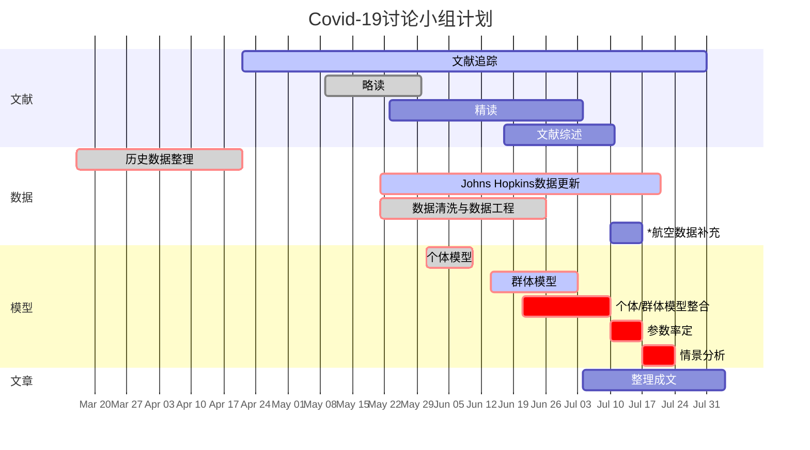

---
bibliography:["COVID-19文库.bib"]
---

# 1 项目框架

# 2 传播动力学模型
## 2.1 群体模型：SIRS^[1]

$$\frac{dS}{dt}=-\beta SI+ \gamma R$$

$$\frac{dI}{dt}=\beta SI - \mu I$$

$$\frac{dR}{dt}=\mu I - \gamma R$$

| 变量 | 说明 | 备注 |
| :----:| :----: | :----: |
| $\beta$ | 有效接触感染率 |  |
| $\mu$ | 治愈率 |  |
| $\gamma$ | 丧失免疫力率 |  |

### 2.1.1 Social contact^[2] ^[3] ^[4]
#### (1) location catagories
Home,Work,School,Others
$\beta_i=\Sigma (\alpha^{sc}(1-\rho_j)+\alpha^c\rho_j)\frac{I_j}{N_j}C^l_{ij}$ 
其中$(1-\rho_j)$ 对应asymptomatic group，$\rho_j$ 对应sub-clinical group

$C=\beta_hC^h+\beta_wC^w+\beta_wC^w+\beta_oC^o$

## 2.2 个体免疫应答模型

$$\frac{dT}{dt}=d(T_0-T)-\frac{k}{A\alpha} VT$$ 

$$\frac{dI}{dt}=\frac{k}{A\alpha} VT-\delta I$$

$$\frac{dV}{dt}=pI-cV$$

| 变量 | 说明 | 备注 |
| :----:| :----: | :----: |
| $T$ | T细胞数量 |  |
| $T_0$ | T细胞初始量 |  |
| $V$ | 病毒量 |  |
| $I$ | 被感染的T细胞 |  |
| ... | ... | ... |

---
## 进度计划

---
## REFERENCES
[1] Du, Xiangjun, et al. "Evolution-informed forecasting of seasonal influenza A (H3N2)." Science translational medicine 9.413 (2017): eaan5325.
[2] Mossong J, Hens N, Jit M, Beutels P, Auranen K, Mikolajczyk R, et al. (2008) Social Contacts and Mixing Patterns Relevant to the Spread of Infectious Diseases. PLoS Med 5(3): e74. https://doi.org/10.1371/journal.pmed.0050074
[3] Du SQ, Yuan W. Mathematical modeling of interaction between innate and adaptive immune responses in COVID‐19 and implications for viral pathogenesis. J Med Virol. 2020;1–14. 10.1002/jmv.25866 
[4] Prem K, Cook AR, Jit M (2017) Projecting social contact matrices in 152 countries using contact surveys and demographic data. PLoS Comput Biol 13(9): e1005697. https://doi.org/10.1371/journal.pcbi.1005697